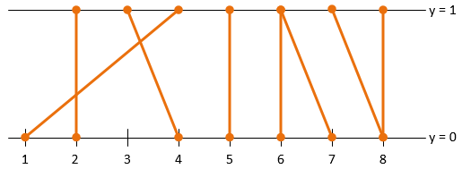

# Задание 5: Число пересечений
Даны отрезки, концы которых имеют целочисленные координаты и один их них (концов) находится на прямой `y=0`, а второй на прямой `y=1`. 

Найти количество пар пересекающихся отрезков.

Имя входного файла с информацией об отрезках задано в командной строке. Ответ необходимо вывести в консоль.

### Формат входного файла
В первой строке входного файла содержится число n (1 ≤ n ≤ 1 000 000) — число отрезков. 

Во второй строке и далее находятся пары целых чисел: координата `x` начала отрезка (точка на прямой `y=0`) и координата `x` конца отрезка (точка на прямой `y=1`).

### Выход
Выведите в консоль количество пар пересекающихся отрезков.


## Пример


```
8
2 2
4 3
1 4
5 5
6 6
7 6
8 7
8 8
```
Ответ: `4` 

## Требования к реализации
Программа не должна использовать контейнеры STL (std::vector, std::string и т. д.). 
